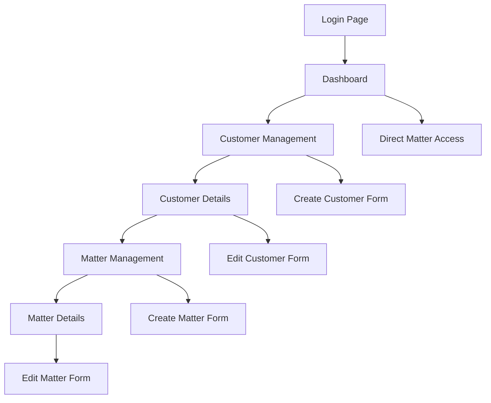

# Legal SaaS Customer & Matter Management System - Product Requirements Document

## 1. Product Overview
A comprehensive legal practice management system designed for law firms to efficiently manage their clients (customers) and associated legal cases (matters). The system provides secure authentication, customer relationship management, and matter tracking capabilities through a modern web interface.

The product solves the challenge of organizing client information and legal cases in a centralized, secure platform. Law firm attorneys, paralegals, and administrative staff will use this system to streamline client management and case tracking workflows.

Target market: Small to medium-sized law firms seeking digital transformation and improved case management efficiency.

## 2. Core Features

### 2.1 User Roles
| Role | Registration Method | Core Permissions |
|------|---------------------|------------------|
| Attorney | Email registration with firm name | Full access to all customers and matters, can create/edit/delete |
| Paralegal | Email registration with firm name | Can view and create customers/matters, limited edit access |
| Admin | Email registration with firm name | Full system access including user management |

### 2.2 Feature Module
Our Legal SaaS system consists of the following main pages:
1. **Login/Signup Page**: User authentication, account creation with firm details
2. **Dashboard Page**: Overview of recent customers and matters, quick access navigation
3. **Customer Management Page**: Customer listing, search, create/edit customer forms
4. **Customer Details Page**: Individual customer information, associated matters list
5. **Matter Management Page**: Matter creation and editing forms under specific customers
6. **Matter Details Page**: Comprehensive matter information and case details

### 2.3 Page Details
| Page Name | Module Name | Feature description |
|-----------|-------------|---------------------|
| Login/Signup Page | Authentication Form | User login with email/password, new user registration with firm name, JWT token management |
| Dashboard Page | Overview Dashboard | Display recent customers and matters, quick statistics, navigation menu |
| Customer Management Page | Customer List | Display all customers in table format, search and filter functionality, create new customer button |
| Customer Management Page | Customer Form | Create/edit customer with name, phone, email, address, and notes fields |
| Customer Details Page | Customer Profile | Show detailed customer information, edit customer details, delete customer option |
| Customer Details Page | Associated Matters | List all matters for the customer, create new matter button, matter status indicators |
| Matter Management Page | Matter Form | Create/edit matter with name, description, case type, status, start date, and notes |
| Matter Details Page | Matter Information | Display comprehensive matter details, case timeline, document attachments, billing information |

## 3. Core Process

**Attorney/User Flow:**
1. User accesses the application and logs in with email/password
2. Upon successful authentication, user is redirected to the dashboard
3. User can navigate to customer management to view all clients
4. User can create new customers by filling out the customer form
5. User clicks on a specific customer to view their details and associated matters
6. User can create new matters for the selected customer
7. User can edit customer or matter information as needed
8. User can delete customers or matters with appropriate confirmations

## 4. User Interface Design

### 4.1 Design Style
- **Primary Colors**: Deep blue (#1e40af) for headers and primary actions, light blue (#3b82f6) for secondary elements
- **Secondary Colors**: Gray (#6b7280) for text, white (#ffffff) for backgrounds, red (#ef4444) for delete actions
- **Button Style**: Rounded corners (8px radius), solid fill for primary actions, outlined for secondary actions
- **Font**: Inter or system fonts, 14px base size, 16px for headings, 12px for captions
- **Layout Style**: Clean card-based design with consistent spacing, top navigation bar, sidebar for main navigation
- **Icons**: Heroicons or similar minimalist icon set, consistent sizing and stroke width

### 4.2 Page Design Overview
| Page Name | Module Name | UI Elements |
|-----------|-------------|-------------|
| Login/Signup Page | Authentication Form | Centered card layout, branded header, form inputs with validation, primary action buttons |
| Dashboard Page | Overview Dashboard | Grid layout with metric cards, recent activity list, quick action buttons |
| Customer Management Page | Customer List | Data table with sorting/filtering, search bar, floating action button for new customer |
| Customer Details Page | Customer Profile | Two-column layout, customer info card on left, matters list on right |
| Matter Management Page | Matter Form | Single-column form layout, grouped fields, progress indicators for multi-step forms |
| Matter Details Page | Matter Information | Tabbed interface for different matter aspects, timeline view, document grid |

### 4.3 Responsiveness
The application is desktop-first with mobile-adaptive design. Touch interaction optimization is implemented for mobile devices, including larger touch targets and swipe gestures for navigation. Responsive breakpoints at 768px (tablet) and 1024px (desktop) ensure optimal viewing across all device sizes.