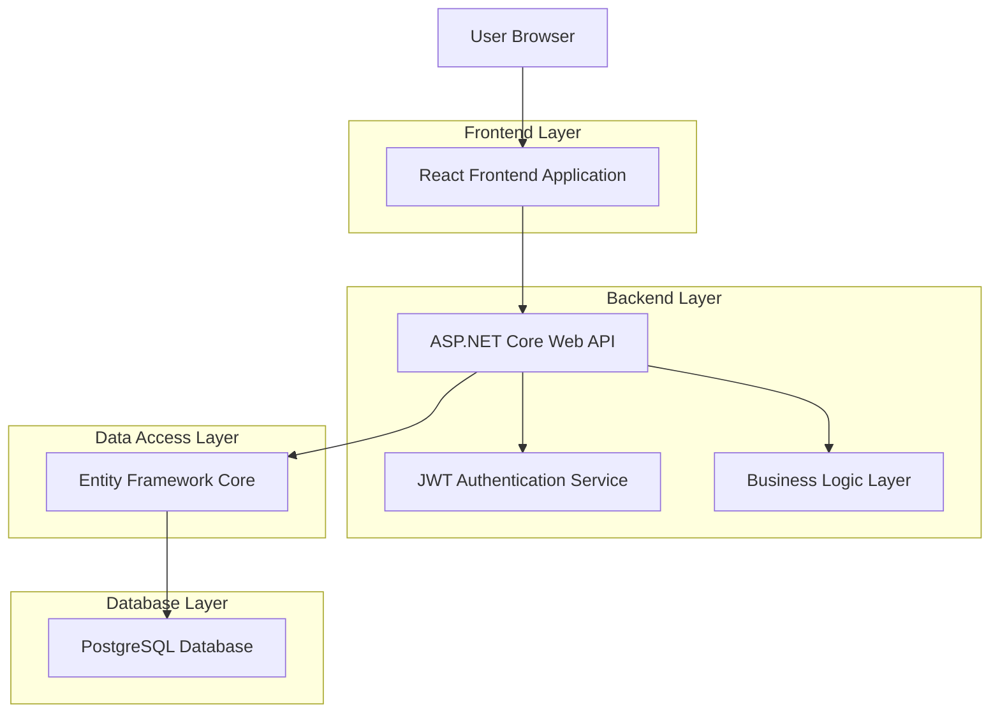
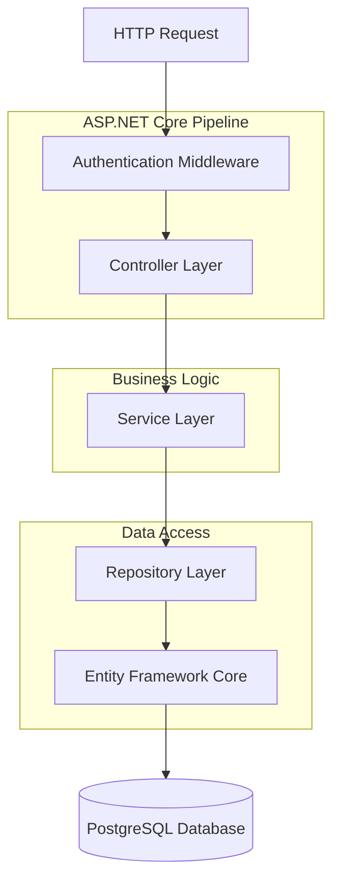
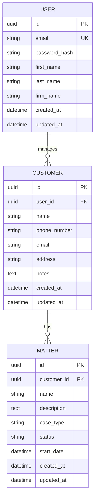

# Legal SaaS Customer & Matter Management System - Technical Architecture Document

## 1. Architecture Design



## 2. Technology Description

* **Frontend**: React\@18 + TailwindCSS\@3 + Vite + Axios for API calls

* **Backend**: ASP.NET Core\@8 + Entity Framework Core + JWT Authentication

* **Database**: PostgreSQL (In-Memory for development)

* **Authentication**: JWT Bearer tokens with bcrypt password hashing

## 3. Route Definitions

| Route                            | Purpose                                 |
| -------------------------------- | --------------------------------------- |
| /                                | Landing page with login/signup options  |
| /login                           | User authentication page                |
| /signup                          | New user registration page              |
| /dashboard                       | Main dashboard with overview            |
| /customers                       | Customer management and listing         |
| /customers/:id                   | Individual customer details and matters |
| /customers/:id/matters/new       | Create new matter for customer          |
| /customers/:id/matters/:matterId | Matter details and editing              |

## 4. API Definitions

### 4.1 Core API

**Authentication Endpoints**

```
POST /api/auth/signup
```

Request:

| Param Name | Param Type | isRequired | Description                |
| ---------- | ---------- | ---------- | -------------------------- |
| email      | string     | true       | User email address         |
| password   | string     | true       | User password (plain text) |
| firmName   | string     | true       | Law firm name              |
| firstName  | string     | true       | User first name            |
| lastName   | string     | true       | User last name             |

Response:

| Param Name | Param Type | Description              |
| ---------- | ---------- | ------------------------ |
| token      | string     | JWT authentication token |
| user       | object     | User information         |
| success    | boolean    | Operation success status |

```
POST /api/auth/login
```

Request:

| Param Name | Param Type | isRequired | Description        |
| ---------- | ---------- | ---------- | ------------------ |
| email      | string     | true       | User email address |
| password   | string     | true       | User password      |

Response:

| Param Name | Param Type | Description              |
| ---------- | ---------- | ------------------------ |
| token      | string     | JWT authentication token |
| user       | object     | User information         |
| success    | boolean    | Operation success status |

```
GET /api/auth/me
```

Headers: Authorization: Bearer {token}

Response:

| Param Name | Param Type | Description     |
| ---------- | ---------- | --------------- |
| id         | string     | User ID         |
| email      | string     | User email      |
| firmName   | string     | Law firm name   |
| firstName  | string     | User first name |
| lastName   | string     | User last name  |

**Customer Management Endpoints**

```
GET /api/customers
```

Headers: Authorization: Bearer {token}

Response: Array of customer objects

```
POST /api/customers
```

Request:

| Param Name  | Param Type | isRequired | Description            |
| ----------- | ---------- | ---------- | ---------------------- |
| name        | string     | true       | Customer full name     |
| phoneNumber | string     | true       | Customer phone number  |
| email       | string     | false      | Customer email address |
| address     | string     | false      | Customer address       |
| notes       | string     | false      | Additional notes       |

```
GET /api/customers/{customerId}
```

Headers: Authorization: Bearer {token}

```
PUT /api/customers/{customerId}
```

Request: Same as POST /api/customers

```
DELETE /api/customers/{customerId}
```

Headers: Authorization: Bearer {token}

**Matter Management Endpoints**

```
GET /api/customers/{customerId}/matters
```

Headers: Authorization: Bearer {token}

```
POST /api/customers/{customerId}/matters
```

Request:

| Param Name  | Param Type | isRequired | Description           |
| ----------- | ---------- | ---------- | --------------------- |
| name        | string     | true       | Matter name/title     |
| description | string     | true       | Matter description    |
| caseType    | string     | false      | Type of legal case    |
| status      | string     | false      | Current matter status |
| startDate   | datetime   | false      | Matter start date     |

```
GET /api/customers/{customerId}/matters/{matterId}
```

Headers: Authorization: Bearer {token}

## 5. Server Architecture Diagram



## 6. Data Model

### 6.1 Data Model Definition



### 6.2 Data Definition Language

**User Table**

```sql
CREATE TABLE users (
    id UUID PRIMARY KEY DEFAULT gen_random_uuid(),
    email VARCHAR(255) UNIQUE NOT NULL,
    password_hash VARCHAR(255) NOT NULL,
    first_name VARCHAR(100) NOT NULL,
    last_name VARCHAR(100) NOT NULL,
    firm_name VARCHAR(200) NOT NULL,
    created_at TIMESTAMP WITH TIME ZONE DEFAULT NOW(),
    updated_at TIMESTAMP WITH TIME ZONE DEFAULT NOW()
);

CREATE INDEX idx_users_email ON users(email);
```

**Customer Table**

```sql
CREATE TABLE customers (
    id UUID PRIMARY KEY DEFAULT gen_random_uuid(),
    user_id UUID NOT NULL,
    name VARCHAR(200) NOT NULL,
    phone_number VARCHAR(20) NOT NULL,
    email VARCHAR(255),
    address TEXT,
    notes TEXT,
    created_at TIMESTAMP WITH TIME ZONE DEFAULT NOW(),
    updated_at TIMESTAMP WITH TIME ZONE DEFAULT NOW()
);

CREATE INDEX idx_customers_user_id ON customers(user_id);
CREATE INDEX idx_customers_name ON customers(name);
```

**Matter Table**

```sql
CREATE TABLE matters (
    id UUID PRIMARY KEY DEFAULT gen_random_uuid(),
    customer_id UUID NOT NULL,
    name VARCHAR(300) NOT NULL,
    description TEXT NOT NULL,
    case_type VARCHAR(100),
    status VARCHAR(50) DEFAULT 'Active',
    start_date TIMESTAMP WITH TIME ZONE,
    created_at TIMESTAMP WITH TIME ZONE DEFAULT NOW(),
    updated_at TIMESTAMP WITH TIME ZONE DEFAULT NOW()
);

CREATE INDEX idx_matters_customer_id ON matters(customer_id);
CREATE INDEX idx_matters_status ON matters(status);
CREATE INDEX idx_matters_start_date ON matters(start_date DESC);
```

**Initial Data**

```sql
-- Sample user for testing
INSERT INTO users (email, password_hash, first_name, last_name, firm_name)
VALUES ('admin@lawfirm.com', '$2a$10$example_hash', 'John', 'Doe', 'Doe & Associates Law Firm');

-- Sample customers
INSERT INTO customers (user_id, name, phone_number, email, address)
VALUES 
    ((SELECT id FROM users WHERE email = 'admin@lawfirm.com'), 'Jane Smith', '555-0123', 'jane.smith@email.com', '123 Main St, City, State 12345'),
    ((SELECT id FROM users WHERE email = 'admin@lawfirm.com'), 'Robert Johnson', '555-0456', 'robert.j@email.com', '456 Oak Ave, City, State 12345');

-- Sample matters
INSERT INTO matters (customer_id, name, description, case_type, status, start_date)
VALUES 
    ((SELECT id FROM customers WHERE name = 'Jane Smith'), 'Divorce Proceedings', 'Contested divorce case with child custody issues', 'Family Law', 'Active', NOW()),
    ((SELECT id FROM customers WHERE name = 'Robert Johnson'), 'Contract Dispute', 'Business contract breach case', 'Business Law', 'Active', NOW());
```

