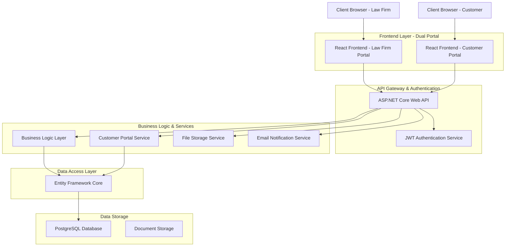
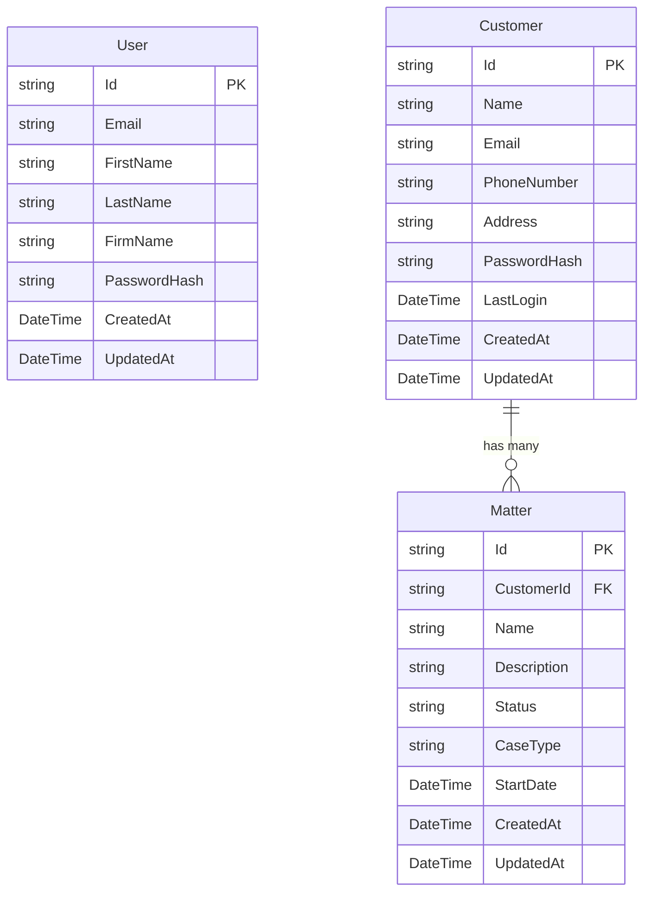
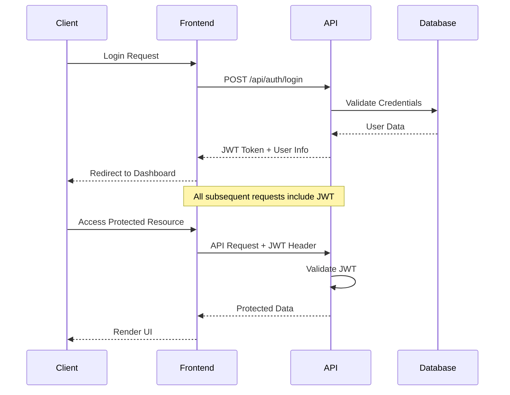

# LegalFlow - Legal Practice Management System - Technical Architecture Document

## 1. System Architecture Overview



## 2. Technology Stack

### 2.1 Frontend Technologies
* **Framework**: React 18 with TypeScript for type safety
* **Styling**: Tailwind CSS 3.x for utility-first styling
* **Build Tool**: Vite for fast development and optimized builds
* **State Management**: Zustand for lightweight global state
* **HTTP Client**: Axios with custom interceptors for API communication
* **Routing**: React Router v6 for client-side navigation
* **UI Components**: Custom component library with Lucide React icons

### 2.2 Backend Technologies
* **Framework**: ASP.NET Core 9.0 Web API
* **ORM**: Entity Framework Core with Code-First approach
* **Authentication**: JWT Bearer tokens with BCrypt password hashing
* **Database**: PostgreSQL (In-Memory for development/testing)
* **Architecture**: Clean Architecture with Repository/Service patterns
* **Testing**: xUnit with comprehensive service layer coverage

### 2.3 Infrastructure & DevOps
* **Development Server**: Vite dev server with hot module replacement
* **API Development**: .NET CLI with hot reload capabilities
* **Version Control**: Git with conventional commits
* **Package Management**: npm for frontend, NuGet for backend

## 3. Application Architecture

### 3.1 Frontend Architecture - Dual Portal System

```
src/
├── components/                    # Reusable UI components
│   ├── ui/                       # Basic UI elements (Button, Input, Card)
│   ├── layout/                   # Layout components (Header, Navigation)
│   ├── auth/                     # Authentication components
│   ├── customer/                 # Customer portal specific components
│   └── dashboard/                # Law firm dashboard components
├── pages/                        # Page-level components
│   ├── Login.tsx                 # Unified login for both portals
│   ├── Dashboard.tsx             # Law firm dashboard
│   ├── Customers.tsx             # Customer management
│   ├── CustomerForm.tsx          # Customer creation/editing
│   ├── Matters.tsx               # Matter management
│   ├── MatterForm.tsx            # Matter creation/editing
│   └── CustomerPortal.tsx        # Customer portal dashboard
├── stores/                       # State management
│   └── authStore.ts              # Authentication state
├── services/                     # API service layer
│   ├── authService.ts            # Authentication API calls
│   ├── customerService.ts        # Customer management APIs
│   └── matterService.ts          # Matter management APIs
├── types/                        # TypeScript type definitions
├── constants/                    # Application constants
└── utils/                        # Utility functions and helpers
```

### 3.2 Backend Architecture - Clean Architecture

```
api/
├── Controllers/                  # API endpoints
│   ├── AuthController.cs         # Authentication endpoints
│   ├── CustomersController.cs    # Customer management APIs
│   ├── MattersController.cs      # Matter management APIs
│   └── CustomerPortalController.cs # Customer portal specific APIs
├── Services/                     # Business logic layer
│   ├── Interfaces/               # Service contracts
│   │   ├── IAuthService.cs
│   │   ├── ICustomerService.cs
│   │   ├── IMatterService.cs
│   │   └── ICustomerAuthService.cs
│   ├── AuthService.cs            # User authentication logic
│   ├── CustomerService.cs        # Customer business logic
│   ├── MatterService.cs          # Matter business logic
│   └── CustomerAuthService.cs    # Customer portal authentication
├── Repositories/                 # Data access layer
│   ├── Interfaces/               # Repository contracts
│   │   ├── IUserRepository.cs
│   │   ├── ICustomerRepository.cs
│   │   └── IMatterRepository.cs
│   ├── UserRepository.cs         # User data operations
│   ├── CustomerRepository.cs     # Customer data operations
│   └── MatterRepository.cs       # Matter data operations
├── Models/                       # Entity models
│   ├── User.cs                   # Law firm user entity
│   ├── Customer.cs               # Customer entity
│   └── Matter.cs                 # Legal matter entity
├── DTOs/                         # Data transfer objects
│   ├── AuthDTOs.cs              # Authentication DTOs
│   ├── CustomerDTOs.cs          # Customer management DTOs
│   └── MatterDTOs.cs            # Matter management DTOs
└── Data/                         # Database context
    └── ApplicationDbContext.cs   # EF Core database context
```

## 4. API Endpoint Documentation

### 4.1 Authentication Endpoints
| Method | Endpoint | Purpose | Authentication |
|--------|----------|---------|----------------|
| POST | `/api/auth/register` | Law firm user registration | None |
| POST | `/api/auth/login` | Law firm user login | None |
| GET | `/api/auth/profile` | Get current user profile | JWT Required |
| POST | `/api/customer/login` | Customer portal login | None |
| GET | `/api/customer/profile` | Get customer profile | Customer JWT |
| GET | `/api/customer/matters` | Get customer's matters | Customer JWT |

### 4.2 Customer Management Endpoints
| Method | Endpoint | Purpose | Authentication |
|--------|----------|---------|----------------|
| GET | `/api/customers` | List all customers | JWT Required |
| GET | `/api/customers/{id}` | Get specific customer | JWT Required |
| POST | `/api/customers` | Create new customer | JWT Required |
| PUT | `/api/customers/{id}` | Update customer | JWT Required |
| DELETE | `/api/customers/{id}` | Delete customer | JWT Required |

### 4.3 Matter Management Endpoints
| Method | Endpoint | Purpose | Authentication |
|--------|----------|---------|----------------|
| GET | `/api/matters` | List all matters | JWT Required |
| GET | `/api/matters/{id}` | Get specific matter | JWT Required |
| POST | `/api/matters` | Create new matter | JWT Required |
| PUT | `/api/matters/{id}` | Update matter | JWT Required |
| DELETE | `/api/matters/{id}` | Delete matter | JWT Required |
| GET | `/api/matters/customer/{customerId}` | Get matters by customer | JWT Required |

## 5. Database Schema

### 5.1 Entity Relationships


### 5.2 Entity Details

**User Entity (Law Firm Staff)**
- Primary authentication for law firm portal access
- Stores firm information for multi-tenant architecture
- BCrypt hashed passwords for security
- Role-based access control ready

**Customer Entity (Clients)**
- Separate authentication system for customer portal
- Contains contact information and portal credentials
- Tracks last login for security monitoring
- Links to associated legal matters

**Matter Entity (Legal Cases)**
- Represents individual legal cases or matters
- Foreign key relationship to Customer entity
- Status tracking for case progress
- Flexible case type classification

## 6. Security Architecture

### 6.1 Authentication Flow


### 6.2 Customer Portal Security
- **Separate JWT System**: Independent token management for customer access
- **Data Isolation**: Customers can only access their own information
- **Password Management**: Secure password assignment by law firm staff
- **Session Security**: Automatic logout on token expiration

### 6.3 Data Protection Measures
- **HTTPS Only**: All communications encrypted in transit
- **Password Hashing**: BCrypt with salt for all user passwords
- **JWT Security**: Secure token generation with expiration
- **Input Validation**: Server-side validation for all API inputs
- **CORS Configuration**: Restricted cross-origin requests

## 7. Development & Deployment

### 7.1 Development Environment Setup
```bash
# Frontend Development
cd src/
npm install
npm run dev

# Backend Development
cd api/
dotnet restore
dotnet run

# Running Tests
cd LegalSaasApi.Tests/
dotnet test
```

### 7.2 Build & Deployment Process
```bash
# Production Build
npm run build
dotnet publish --configuration Release

# Database Migration
dotnet ef database update
```

### 7.3 Environment Configuration
- **Development**: In-memory database, hot reload enabled
- **Staging**: PostgreSQL database, logging enabled
- **Production**: PostgreSQL with connection pooling, security headers

## 8. Performance & Scalability

### 8.1 Performance Optimizations
- **Frontend**: Code splitting, lazy loading, optimized bundles
- **Backend**: Async/await patterns, efficient database queries
- **Database**: Proper indexing, query optimization
- **Caching**: Application-level caching for frequently accessed data

### 8.2 Scalability Considerations
- **Horizontal Scaling**: Stateless API design for load balancing
- **Database Scaling**: Read replicas for customer portal queries
- **CDN Integration**: Static asset delivery optimization
- **Microservices Ready**: Clean architecture enables future service separation

This technical architecture provides a robust foundation for LegalFlow, ensuring security, scalability, and maintainability while supporting the dual-portal approach that distinguishes this legal practice management system.
